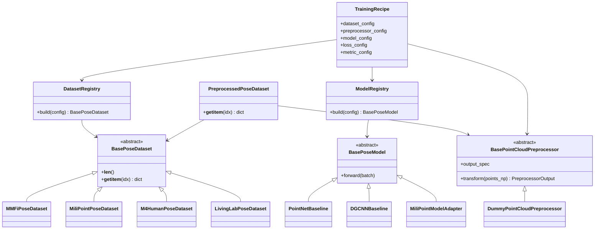
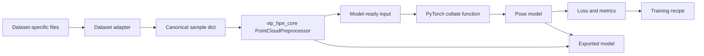

# Group 2 TODO: ML Subsystem Design Review

## Purpose

Group 2 will prepare the design groundwork for the future `ml/` subsystem. The goal is **not** to immediately train models, install every external repository, or solve difficult dependency issues. The goal is to design a clean and extensible ML framework that require **very minimal** modifications to be made each time a new radar pose-estimation dataset, pose-estimation model or training/evaluation protocol is introduced.

The planned `ml/` subsystem will use the following codebases as major reference points:

- MM-Fi dataset/toolbox: <https://github.com/ybhbingo/MMFi_dataset>
- MiliPoint repository: <https://github.com/yizzfz/MiliPoint>
- M4Human repository: <https://github.com/FanJunqiao/M4Human>

Keeping in mind that, depending on how soon we can secure the Vayyar vTrigB radar, we may switch to using the M4Human dataset.

The key design principle is: **encapsulate what varies**.

The students should identify what changes between datasets, models, training recipes, evaluation methods, preprocessing steps, target formats, and train-test-split protocols. The system should be designed so that adding a new dataset, model, training recipe, or evaluation method requires the smallest possible change to the existing codebase.

Tasks 1 and 2 should be treated as the **requirements gathering** stage of this software engineering project. The obvious high-level requirement is:

> Support training, testing, comparison, and eventual deployment of different mmWave-radar-point-cloud-based human pose estimation models using different datasets.

However, this requirement is too vague until students inspect real datasets and real codebases. For example, one dataset/model may use only `(x, y, z)` point clouds, while another may use `(x, y, z, Doppler, SNR)`. One model may predict 3D keypoints, while another may predict 2D keypoints. If the framework is hardcoded for 3D pose estimation, then switching to a 2D pose model would ripple through losses, metrics, plotting, visualisation, target transforms, model outputs, and evaluation code. The purpose of the repo/paper exploration is to discover these variation points early, before we accidentally build a rigid framework.

---

## Ground Rules

Do **not** modify the ROS 2 runtime environment.

Do **not** add PyTorch, CUDA, PyTorch Geometric, MiliPoint, MM-Fi, or M4Human dependencies to `vip_ros2_jazzy_dev.yml`.

Do **not** copy entire external repositories into this repository.

Do **not** commit datasets, checkpoints, exported models, pickle files, or large binary files.

Do **not** start implementing the full ML framework until the design has been reviewed.

Small scratch experiments are fine, but they should be time-boxed and documented. The priority is design, not installation/debugging.

Sometimes it is difficult to understand a dataset or codebase by reading alone. Students may need to install a repository or download a small dataset subset to inspect sample shapes, return types, coordinate conventions, or model inputs. This is allowed, but it should be treated as exploration, not the main task. Avoid spending significant time trying to run code for a dataset that is poorly supported, requires permission from the authors before any data can be downloaded, or has no option to only download a small subset of the data if the dataset is ver large.

---

## Expected Output

The group should produce a short design report, preferably:

```text
docs/ml_system_design.md
docs/diagrams/ml_system_class_diagram.md
docs/diagrams/ml_training_pipeline.md
ml/scratch/README.md
```

Optional scratch scripts may be submitted if they helped the team understand dataset shapes or model input/output assumptions, for example:

```text
ml/scratch/inspect_mmfi_sample.py
ml/scratch/inspect_milipoint_sample.py
ml/scratch/inspect_m4human_sample.py
```

Scratch scripts are not expected to be production quality, but they should be readable and clearly marked as exploratory.

---

## Task 1: Read the Papers with a Software-Design Lens

Read the MM-Fi, MiliPoint, and M4Human papers and use the code repositories for further reference. Do not write a generic literature summary. Focus on information that affects software design. You don't necessarily need to limit yourself to those papers/repos. The more you expose yourself to different papers/repos, the more you will understand what is common and what varies amongst the datasets, models, and training protocols. Here is a table of datasets which is a work in progress but it might be useful: [mmwave_datasets.xlsx](https://unsw-my.sharepoint.com/:x:/g/personal/z5162987_ad_unsw_edu_au/IQBIbDwyEpYAQb-Ix8Oo8GShAb7Jvlih3BcsAVprYaCNLng?e=8D3vtI)

Treat this task as requirements gathering. The question is not only “what did the paper do?” but “what requirements would our framework need to satisfy if we wanted to reproduce, adapt, or compare this kind of method?”

For each paper/repo, answer:

1. What is the input representation?
2. What is the prediction target?
3. Is the task frame-level, sequence-level, or both?
4. What coordinate frame is used?
5. What skeleton/keypoint convention is used?
6. What model families are evaluated?
7. What evaluation protocols or splits are used?
8. What assumptions would break if we plugged this dataset into a different model?
9. What assumptions would break if we plugged this model into a different dataset?
10. Does the method predict 2D pose, 3D pose, or both? What would need to change in losses, metrics, visualisation, and evaluation if we switched between 2D and 3D? How could we design a system to support both?

One suggestion is to create a concise comparison table:

| Paper/repo | Input | Target | Single frame or sequence of frames input?  | Keypoint convention | Model families | Main design issue for us |
|---|---|---|---|---|---|---|
| MM-Fi | TODO | TODO | TODO | TODO | TODO | TODO |
| MiliPoint | TODO | TODO | TODO | TODO | TODO | TODO |
| M4Human | TODO | TODO | TODO | TODO | TODO | TODO |

The goal is to extract the assumptions that our framework must isolate.

---

## Task 2: Compare Dataset Classes and Identify What Varies

Inspect the dataset code from at least these repositories:

```text
MM-Fi's MMFi_Dataset class:
https://github.com/ybhbingo/MMFi_dataset/blob/main/mmfi_lib/mmfi.py

MiliPoint's MMRKeypointData class:
https://github.com/yizzfz/MiliPoint/blob/main/mmrnet/dataset/mmrnet_data.py

M4Human's RF3DPoseDataset class:
https://github.com/FanJunqiao/M4Human/blob/main/dataset/m4human_dataset.py
```

This task is also requirements gathering. Reading code may be enough, but students may run a small local probe if needed. For example, it can be useful to instantiate a dataset, call `__getitem__`, and print the keys, shapes, dtypes, and target format. Only do this if a small subset of the data is available and the setup is not a major time sink.

Focus especially on how each repository implements `torch.utils.data.Dataset` or an equivalent dataset abstraction.

The goal is to identify what varies between datasets.

Consider questions such as:

- How does each dataset find files on disk?
- What does `__getitem__` return?
- Are samples frame-based or sequence-based?
- Does the dataset return NumPy arrays, Torch tensors, dictionaries, tuples, or custom objects?
- Does the point cloud contain only `(x, y, z)`, or additional fields such as Doppler/velocity and SNR?
- Does the dataset provide 2D pose labels, 3D pose labels, or both?
- Are point clouds fixed-size or variable-size?
- Do these datasets load raw point cloud data or do they save some preprocessed intermediate representation? Would this preprocessing need to be performed at runtime in a live system?
- Where is padding handled?
- Where are coordinate transforms handled?
- Where are skeleton/keypoint conventions handled?
- How are train/validation/test splits defined?
- How much logic is hardcoded inside the dataset class?
- Which parts of the code are reusable, and which parts are too dataset-specific?

Use MiliPoint as a specific design stress test. MiliPoint already implements multiple pose-estimation models, but students should check whether its current design is general enough for our project. For example, MiliPoint is built around a dataset where each point cloud only provides `(x, y, z)` coordinates. Most other mmWave datasets provide Doppler/velocity and SNR for each point, i.e. something closer to `(x, y, z, D, S)`. Students should check whether MiliPoint hardcodes the input channel count or assumes xyz-only inputs inside its datasets, preprocessing, models, or training scripts. They should also check whether the MiliPoint framework could naturally support both 2D and 3D pose estimation, or whether target dimensionality is hardcoded in ways that would make this difficult.

One suggestion is to create a table like this:

| Design question | MM-Fi | MiliPoint | M4Human | Recommendation for our framework |
|---|---|---|---|---|
| Dataset base class |  |  |  |  |
| Return type from `__getitem__` |  |  |  |  |
| Point-cloud shape |  |  |  |  |
| Pose target shape |  |  |  |  |
| Frame vs sequence handling |  |  |  |  |
| Padding strategy |  |  |  |  |
| Split handling |  |  |  |  |
| Coordinate transforms |  |  |  |  |
| Keypoint convention handling |  |  |  |  |
| Caching/preprocessing |  |  |  |  |

Questions to answer:

1. What does each dataset return from `__getitem__`?
2. Does the dataset return NumPy arrays, PyTorch tensors, PyTorch Geometric objects, dictionaries, tuples, or something else?
3. Is the point cloud variable-length or fixed-length?
4. Is padding handled in the dataset, collate function, model, or preprocessing step?
5. Are frame-level and sequence-level samples represented differently?
6. Where are dataset splits defined?
7. Are coordinate transforms performed inside the dataset class?
8. Are keypoints remapped inside the dataset class?
9. Which parts are dataset-specific and should not leak into the rest of our training code?

---

## Task 3: Define the Common Sample Contract

After comparing datasets, propose a common sample format for our project. The sample contract is important because the training code should not need to modify its own behavior based on whether the sample came from MM-Fi, MiliPoint, M4Human, or any other dataset. It should also avoid hardcoding one target type. If the system supports both 2D and 3D pose estimation, the distinction between `pose_2d` and `pose_3d` should be represented cleanly rather than handled by scattered special cases.

The exact fields can be changed, but start with something like:

```python
sample = {
    "sample_id": str,
    "dataset_name": str,
    "subject_id": str | None,
    "action_id": str | None,
    "scene_id": str | None,
    "frame_index": int | None,

    "points": np.ndarray,
    "pose_3d": np.ndarray | None,
    "pose_2d": np.ndarray | None,
    "metadata": dict,
}
```

The design report should answer:

1. Should dataset wrappers return NumPy arrays or PyTorch tensors?
2. Should dataset wrappers return raw dataset coordinates or already-transformed coordinates? I.e. when should we apply the `PointCloudPreprocessor`?
3. How should temporal samples be represented?
4. How should missing pose labels be represented?
5. How should dataset-specific metadata be preserved?
6. How should subject/action/scene/frame IDs be represented consistently?
7. Should the same sample contract support MM-Fi, MiliPoint, M4Human, and Living Lab?
8. How should the sample indicate whether the target is 2D, 3D, or both?

Recommended starting principle:

> Dataset wrappers should return NumPy arrays and metadata. Conversion to PyTorch tensors should happen later, near the collate function or training step.

This keeps `vip_hpe_core` usable by both training code and the ROS runtime.

---

## Task 4: Propose the main abstractions

The design should make it easy to add a new dataset, model, training recipe, or evaluation method by changing as little existing code as possible.

Students should think of this as designing a set of configurable components. The dataset, preprocessor, model, loss, metrics, and evaluation protocol should be chosen from config files where possible, not hardcoded inside a training script. This mirrors the existing `PointCloudPreprocessor` factory pattern and the ROS session launch design.

This is where the idea of a **wrapper** is useful.

A wrapper is a class that adapts external or dataset-specific code into our project’s expected interface. For example, MM-Fi, MiliPoint, and M4Human may all load data differently, but each wrapper can return the same project-level sample dictionary. The rest of the training pipeline can then ignore the original dataset format.

Suggested abstractions to consider:

### Dataset abstraction

```python
class BasePoseDataset(torch.utils.data.Dataset):
    """Returns samples using the project sample contract."""
```

Possible implementations:

```text
MMFiPoseDataset
MiliPointPoseDataset
M4HumanPoseDataset
LivingLabPoseDataset
```

The dataset classes should hide differences in file layout, annotation format, split handling, sequence construction, and target formatting.

### Preprocessor abstraction

This already exists in `vip_hpe_core`.

The students should propose how the ML system should use it:

```text
raw dataset sample
  -> PointCloudPreprocessor built from YAML config
  -> model-ready input
  -> PyTorch collate function (if necessary)
  -> model
```

The design should preserve the idea that preprocessors are configured, not hardcoded.

### Model abstraction

```python
class BasePoseModel(torch.nn.Module):
    """Pose-estimation model with a documented input/output contract."""
```

Possible implementations:

```text
PointNetBaseline
DGCNNBaseline
PointTransformerBaseline
MiliPointModelAdapter
```

The model class should not know about MM-Fi paths, MiliPoint paths, or M4Human paths. It should only know the model input format.

Students should also consider whether the system needs separate model-output specifications for 2D and 3D pose. A 2D model and 3D model may share similar dataset/model infrastructure, but they usually need different target adapters, losses, metrics, plotting, and evaluation logic.

### Training/evaluation recipe abstraction

The training script should not hardcode the dataset, model, loss, metric, or preprocessing mode.

A recommended direction is to use config-driven factories, similar to how the point-cloud preprocessor is built from YAML and similar to how the run-time ROS session nodes are built in `src/vip_hpe_runtime/launch/session.launch/py`'s `_launch_setup` function.

For example:

```yaml
dataset:
  name: mmfi
  params:
    root: ${MMFI_ROOT}
    split: cross_subject
    data_unit: frame

preprocessor:
  name: dummy_pointcloud
  params:
    expected_num_features: 5

model:
  name: pointnet_baseline
  params:
    input_dim: 5
    num_joints: 17
    output_dims: 3

training:
  batch_size: 32
  max_epochs: 50
  seed: 42

evaluation:
  metrics:
    - mpjpe
    - pck
```

Recommended builder/factory pattern:

```python
dataset = build_dataset(cfg["dataset"])
preprocessor = build_preprocessor(cfg["preprocessor"])
model = build_model(cfg["model"])
trainer = build_trainer(cfg["training"])
evaluator = build_evaluator(cfg["evaluation"])
```

The report should explain why this is useful:

- adding a new dataset should mostly require a new dataset class and registry entry;
- adding a new model should mostly require a new model class and registry entry;
- training scripts should stay mostly unchanged;
- experiments should be reproducible from config files;
- students should not need to edit a central script every time they try a new model.

---

## Task 5: Produce a Mermaid UML Class Diagram

Create a Mermaid class diagram in:

```text
docs/diagrams/ml_system_class_diagram.mmd
```

The diagram should show the proposed high-level classes and how they relate.

It does not need to be perfect. The purpose is to force students to think clearly about interfaces and responsibilities.

A possible starting point is below. Students may add or rename components such as `TargetAdapter`, `LossFactory`, `MetricFactory`, or `Evaluator` if their design shows that 2D/3D pose targets and different evaluation protocols need to be isolated separately.



Students should modify this based on their findings. They should not simply paste this diagram without thinking.

---

## Task 6: Produce a Mermaid Training Pipeline Diagram

Create a pipeline diagram in:

```text
docs/diagrams/ml_training_pipeline.mmd
```

The diagram should show how data flows through the proposed ML system.

A possible starting point:



The final diagram should show where MM-Fi, MiliPoint, and M4Human differ, and where those differences are hidden behind interfaces.

---

## Task 7: Survey candidate point-cloud-based 3D pose estimation models

This is an additional task that students can work on if they are genuinely blocked or do not yet have a clear implementation role.

Survey the literature for point-cloud-based 3D human pose estimation models that could be considered for implementation in this project.

The survey should not be a generic list of papers. It should focus on implementation feasibility and whether each model could fit behind the proposed `BasePoseModel` / config-driven design:

- Is there available code?
- Is the code in PyTorch?
- Does the model operate directly on point clouds?
- Does it require voxelisation or 3D CNNs? Because this can be computationally expensive.
- Is it likely to be efficient enough for eventual deployment?
- Does it need PyTorch Geometric or other difficult dependencies?
- Is it frame-based or sequence-based?
- What dataset was it originally evaluated on?
- What output does it produce?
- How hard would it be to adapt to MM-Fi or our future Living Lab dataset?
- Could it be wrapped behind a proposed `BasePoseModel` interface?
- Is the paper complete BS?

Suggested comparison table:

| Model/paper | Code available? | PyTorch? | Input representation | Architecture | Uses 3D CNNs? | Efficiency risk | Adaptation difficulty | Notes |
|---|---|---|---|---|---|---|---|---|
| PointNet baseline |  |  |  |  |  |  |  |  |
| DGCNN-style model |  |  |  |  |  |  |  |  |
| PointTransformer-style model |  |  |  |  |  |  |  |  |
| Other candidate |  |  |  |  |  |  |  |  |

The report should not just list papers. It should recommend which models are realistic first choices.

The survey should finish with a shortlist which might look like:

| Priority | Candidate | Why |
|---|---|---|
| 1 | Simple PointNet/MLP baseline | Easy to implement/debug |
| 2 | DGCNN-style model | Stronger point-cloud baseline, but dependency/design cost |
| 3 | PointTransformer-style model | Potentially strong, but more complex |
| 4 | Heavy voxel/3D CNN model | Likely less suitable for efficient deployment |

Students are encouraged to include models that are not from MiliPoint if they appear relevant.

---
